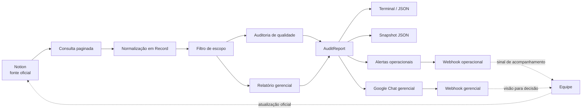
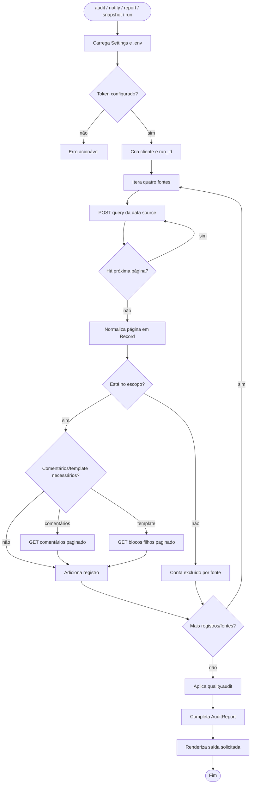
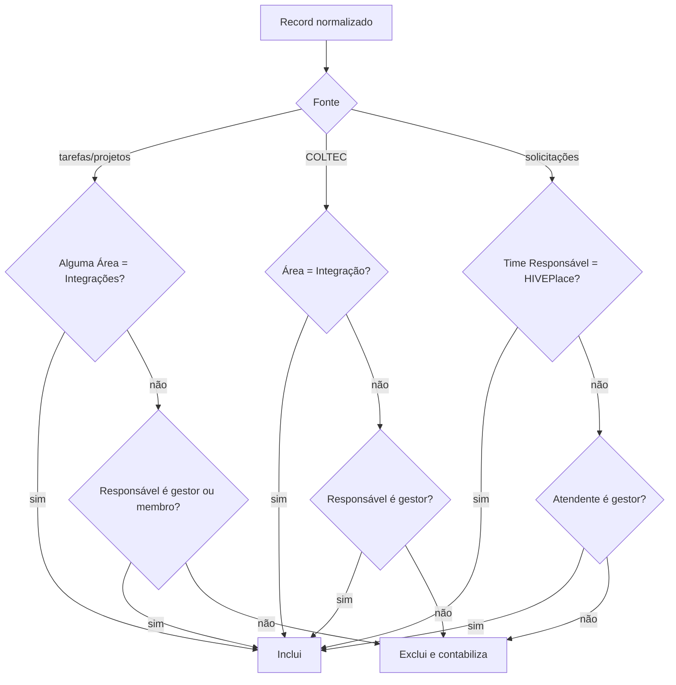
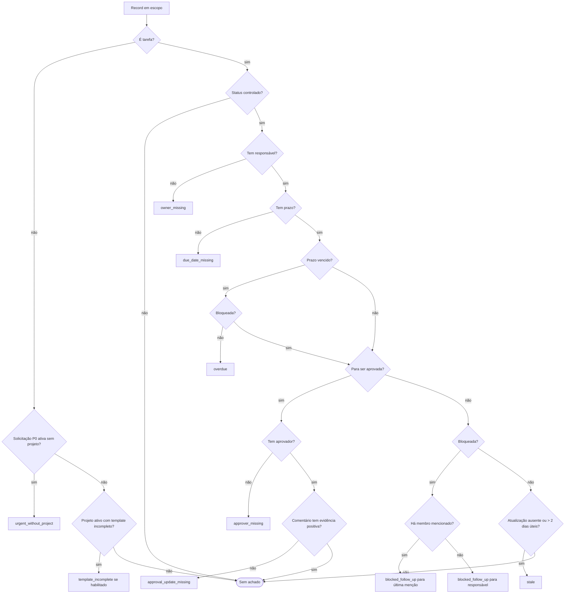
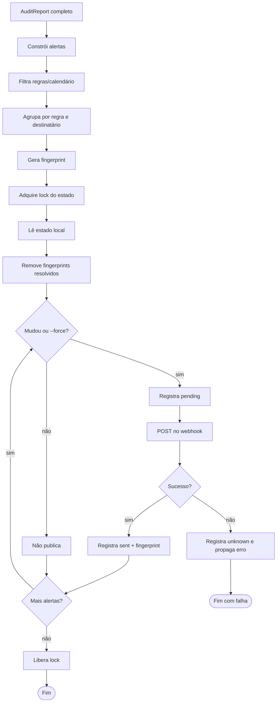
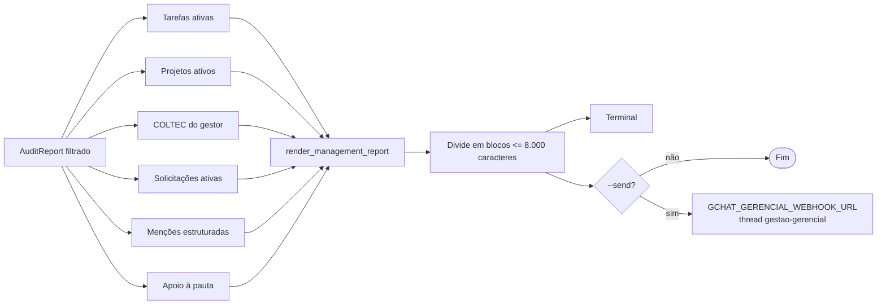
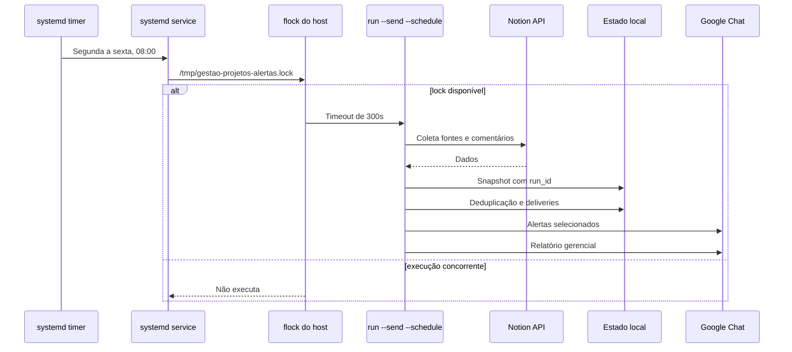

# Visão completa do sistema

## 1. Objetivo e fronteiras

O **Gestão da equipe de Integrações** é uma automação de leitura para consolidar informações gerenciais mantidas no Notion e publicar alertas opcionais no Google Chat.

O sistema atende a quatro fontes:

| Fonte | Conteúdo | Identificação |
| --- | --- | --- |
| Tarefas | Execução técnica, responsável, prazo, aprovação, projeto e comentários | `tasks` |
| Projetos | Iniciativas e documentação técnica | `projects` |
| COLTEC | Assuntos, decisões, ações e riscos gerenciais | `coltec` |
| Solicitações | Demandas de clientes e prazos prometidos | `requests` |

O Notion permanece como fonte oficial. O Google Chat é somente um canal de alerta e coordenação rápida. A aplicação não altera status, propriedades, relações, comentários, páginas ou bases do Notion e não cria tarefas ou projetos automaticamente.



## 2. Capacidades

### Coleta e normalização

- Consulta as quatro data sources do Notion.
- Pagina consultas, comentários e blocos filhos até consumir todos os resultados.
- Usa a versão da API configurada em `NOTION_VERSION` e retry com backoff/jitter para falhas transitórias.
- Normaliza título, texto, status, pessoas, relações, datas, prioridade, área, time responsável e projeto.
- Preserva todas as áreas relacionadas, não apenas a primeira.
- Extrai comentários com texto, data, autor e menções estruturadas.
- Consulta blocos filhos para validar o template técnico.
- Mantém `run_id`, horários, resultado por fonte e indicação de coleta completa.

### Auditoria de qualidade

Os achados carregam fonte, página, título, regra, mensagem, destinatário e link direto.

| Regra | Aplicação | Destinatário / comportamento |
| --- | --- | --- |
| `owner_missing` | Tarefa ativa sem responsável | Responsável não identificado |
| `due_date_missing` | Tarefa ativa sem prazo | Responsável da tarefa |
| `approver_missing` | `Para ser aprovada` sem `Aprovadora` | Responsável da tarefa |
| `overdue` | Prazo vencido, exceto tarefa bloqueada | Responsável da tarefa |
| `stale` | Atualização ausente ou com mais de dois dias úteis | Responsável da tarefa |
| `approval_update_missing` | Aprovação sem evidência positiva ou fora da cadência | Aprovador(es) |
| `blocked_follow_up` | Bloqueio sem avanço recente | Último membro mencionado; fallback para responsável |
| `urgent_without_project` | Solicitação P0 ativa sem projeto técnico | Desabilitado no ciclo atual |
| `template_incomplete` | Template ativo incompleto | Desabilitado no ciclo atual |

Status concluídos (`Feito`, `Done`, `Concluído` e `Concluída`) não geram achados. Tarefas sem projeto são permitidas.

### Alertas operacionais

- Separa pendências por tipo de regra, agrupa por destinatário e limita cada grupo a três exemplos.
- Inclui responsável, aprovador quando aplicável, ação esperada e link direto.
- Publica somente com `notify --send` ou `run --send`.
- Aceita regras explícitas (`--rules`) ou seleção de calendário (`--schedule`).
- Usa threads configuráveis, com `gestao-integracoes` como padrão.
- Usa fingerprint por regra para não reenviar o que não mudou.
- Serializa execuções concorrentes com lock de arquivo.
- Registra estados `pending`, `sent` e `unknown`; falhas ambíguas exigem inspeção consciente.

### Relatório gerencial

`report` reúne tarefas ativas, projetos ativos, COLTEC não concluído do gestor, solicitações ativas, comentários recentes com autor, menções estruturadas ao gestor, apoio à pauta e candidatos a desdobramento. Sugestões não criam registros nem alteram o Notion.

O relatório é dividido em blocos de até 8.000 caracteres e publicado, quando solicitado, exclusivamente em `GCHAT_GERENCIAL_WEBHOOK_URL`, na thread `gestao-gerencial`.

### Snapshots e diagnóstico

- `snapshot` salva a auditoria filtrada em JSON local.
- `run` salva o snapshot da mesma coleta usada pelos alertas e relatório.
- O nome inclui data e `run_id`, preservando múltiplas execuções no mesmo dia.
- `doctor` valida configuração sem rede.
- `deliveries` lista estados e retorna código diferente de zero se existir `unknown`.

## 3. Fluxo de auditoria



Cada fonte é tratada isoladamente. Uma falha marca o relatório como incompleto e registra o tipo da exceção. O relatório parcial pode ser exibido/salvo, mas publicações são bloqueadas quando a coleta não está completa.

## 4. Aplicação do escopo

O escopo sempre vem antes de indicadores, alertas, snapshots e relatório. IDs são comparados sem hífens e sem diferença entre maiúsculas/minúsculas.



Configuração envolvida: `NOTION_INTEGRATIONS_AREA_ID`, `NOTION_MANAGER_ID` e `NOTION_TEAM_MEMBER_IDS`. Para tarefas/projetos, basta a área ou o responsável; para COLTEC, área ou gestor; para solicitações, time HIVEPlace ou gestor.

## 5. Matriz de decisão das regras



Detalhes: a cadência considera dias úteis; `Última atualização`, `Ultima Edição` ou `last_edited_time` são usados como aproximação; autoria e comentário não são inferidos dessa data. Evidência positiva é procurada nos comentários, mas termos negativos têm precedência. Tarefas bloqueadas não geram `overdue`. Os templates exigidos são três seções para tarefas e cinco seções mais `Descrição` para projetos; a validação existe, porém o alerta está desabilitado na fase atual.

## 6. Alertas, deduplicação e entrega



O estado fica em `GCHAT_ALERT_STATE_FILE`, padrão `reports/gchat-alert-state.json`. O sistema mantém `deliveries` além do fingerprint: um timeout pode ocorrer após aceitação do Google Chat, portanto não é marcado silenciosamente como sucesso. O `--schedule` seleciona diariamente `overdue`, `stale`, `approval_update_missing` e `blocked_follow_up`, acrescentando `due_date_missing` às terças e quintas.

## 7. Relatório gerencial



Cada atividade pode exibir responsável, status, prazo, última atividade/status, comentário mais recente, autor e link. Uma menção só é confiável quando é uma menção estruturada ao ID de `NOTION_MANAGER_ID`; texto comum com o nome não basta.

## 8. Modos da CLI

| Comando | Notion | Snapshot | GChat | Finalidade |
| --- | ---: | ---: | ---: | --- |
| `audit` / `audit --json` | consulta | não | não | Auditoria em texto ou JSON |
| `notify` | consulta | não | não | Visualizar pendências |
| `notify --send` | consulta | não | alertas | Publicar alertas operacionais |
| `snapshot` | consulta | sim | não | Salvar baseline |
| `report` | consulta | não | não | Visualizar acompanhamento gerencial |
| `report --send` | consulta | não | relatório | Publicar no espaço gerencial |
| `run` | consulta | sim | não | Coleta única completa |
| `run --send` | consulta | sim | alertas + relatório | Publicar a mesma execução |
| `doctor` | não | não | não | Validar configuração local |
| `deliveries` | não | não | não | Inspecionar entregas |

Opções relevantes: `--rules`, `--schedule`, `--force`, `--initial`, `--validation` e `--thread-key`.

```bash
PYTHONPATH=src python3 -m notion_management doctor
PYTHONPATH=src python3 -m notion_management audit --json
PYTHONPATH=src python3 -m notion_management notify --send --schedule
PYTHONPATH=src python3 -m notion_management snapshot
PYTHONPATH=src python3 -m notion_management report --send
PYTHONPATH=src python3 -m notion_management run --send --schedule
PYTHONPATH=src python3 -m notion_management deliveries
```

## 9. Agendamento



O timer é persistente e recupera ocorrência perdida após o host retornar. O serviço não publica quando a coleta está incompleta.

## 10. Configuração e segurança

O parser próprio lê `.env` sem executá-lo como shell; o ambiente tem precedência. Não registrar tokens, webhooks ou valores secretos em logs, documentos ou commits. O webhook é unidirecional e limitado ao espaço onde foi criado.

| Variável | Finalidade | Padrão |
| --- | --- | --- |
| `NOTION_TOKEN` | Token da integração | obrigatório |
| `NOTION_VERSION` | Versão da API | `2025-09-03` |
| `GCHAT_WEBHOOK_URL` | Alertas operacionais | vazio |
| `GCHAT_GERENCIAL_WEBHOOK_URL` | Relatório gerencial | vazio |
| `GCHAT_PROJECT_LOGO_URL` | Logo HTTPS nos cards | vazio |
| `GCHAT_ALERT_STATE_FILE` | Estado local de entrega | `reports/gchat-alert-state.json` |
| `NOTION_*_DATA_SOURCE_ID` | IDs das quatro fontes | `.env.example` |
| `NOTION_INTEGRATIONS_AREA_ID` | Área de Integrações | `.env.example` |
| `NOTION_MANAGER_ID` | Gestor | `.env.example` |
| `NOTION_TEAM_MEMBER_IDS` | Membros separados por vírgula | `.env.example` |
| `NOTION_SNAPSHOT_DIR` | Diretório de snapshots | `reports/snapshots` |

## 11. Mapa de módulos

| Módulo | Responsabilidade |
| --- | --- |
| `cli.py` | Comandos, opções, códigos de saída e publicação |
| `config.py` | Ambiente e parser seguro do `.env` |
| `notion_api.py` | HTTP Notion, paginação, retry e erros |
| `models.py` | `Comment`, `Record`, `Finding`, `AuditReport` |
| `service.py` | Consulta, normalização, escopo, comentários e orquestração |
| `scope.py` | Regra única de inclusão gerencial |
| `quality.py` | Regras de qualidade e dias úteis |
| `template.py` | Seções obrigatórias |
| `alerting.py` | Alertas, fingerprint, deduplicação e entregas |
| `management_report.py` | Relatório, menções, pauta e divisão |
| `gchat.py` | Cards, HTML, botões, threads e webhook |
| `brand.py` | Tokens visuais e categorias semânticas |
| `snapshot.py` | Persistência JSON |

## 12. Validação, limites e evolução

```bash
PYTHONDONTWRITEBYTECODE=1 PYTHONPATH=src python3 -B -m unittest discover -s tests -v
```

Os testes cobrem qualidade, escopo, normalização, comentários, templates, relatório, cards, deduplicação, falhas ambíguas, snapshots e regressões de coleta incompleta.

Limites atuais: não há escrita automática no Notion; `last_edited_time` não prova autoria; evidência de aprovação é textual e deve ser calibrada; o webhook não oferece leitura nem garantia de entrega exatamente uma vez; views do Notion podem ter filtros próprios; `template_incomplete` e `urgent_without_project` estão desabilitados; snapshots locais dependem de retenção/backup externo.

Documentos relacionados: [`README.md`](../README.md), [`architecture.md`](architecture.md), [`operations.md`](operations.md), [`management-report.md`](management-report.md), [`brand-communication.md`](brand-communication.md) e [`guia-avancado.md`](guia-avancado.md).
